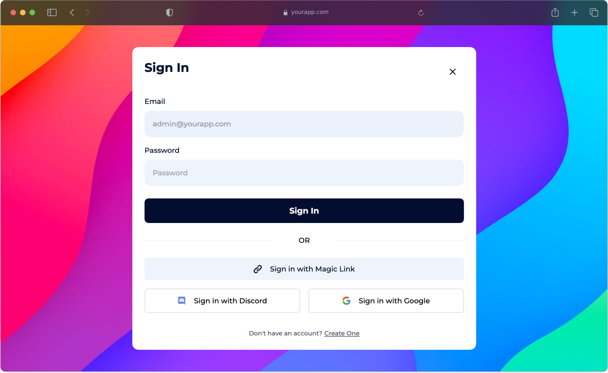
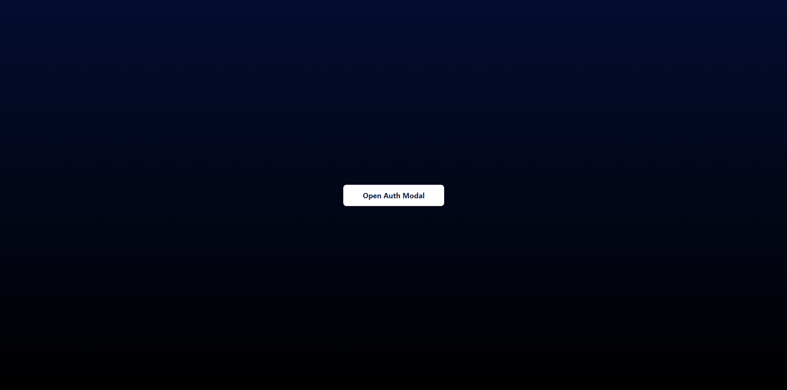
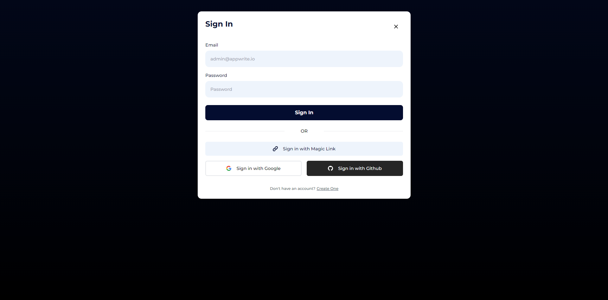
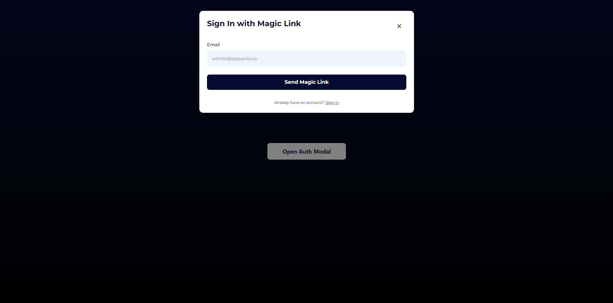
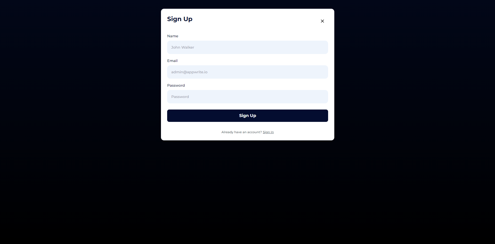
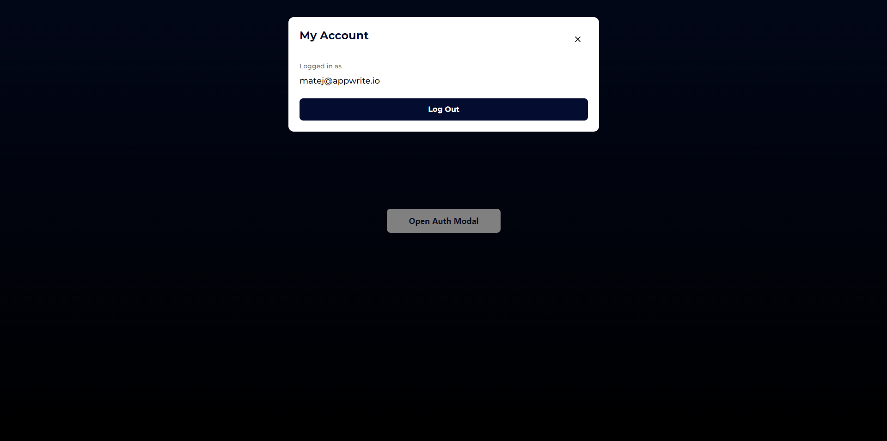

<div id="top"></div>

<!-- PROJECT SUMMARY -->
<br />
<div align="center">
  <a href="hhttps://github.com/TringuG/auth-modal">
    
  </a>

**<h3 align="center">Auth Modal</h3>**

  <p align="center">
    All authorization needs solved in one modal window!
    <br />
    <br />
    <a href="https://auth-modal.vercel.app">View Demo</a>
    ·
    <a href="https://github.com/TringuG/auth-modal/issues">Report Bug</a>
    ·
    <a href="https://github.com/TringuG/auth-modal/issues">Request Feature</a>
  </p>
</div>

<!-- TABLE OF CONTENTS -->

<!-- ABOUT THE PROJECT -->

## ⚡ Quick Showcase



<details>
<summary>More Screenshots! 👀</summary>
<ol>







</ol>
</details>

<p align="right">(<a href="#top">back to top</a>)</p>

## Getting Started

### 📖 Examples

Auth Modal is as [easy as 1-2-3](https://youtu.be/_8m7yhtPsqc?t=94)! Most developers can figure everything out just by looking at our examples 🤯 Please check them out in [examples folder](examples) to see Auth Modal in action.

### ⚙️ Installation

1. Install dependencies at the end of your `<head>` tag:

```html
<!-- Auth Modal Dependencies -->
<script src="https://unpkg.com/alpinejs" defer></script>
<script src="https://cdn.tailwindcss.com"></script>
```

2. Add Auth Modal to your website:

```html
<!-- Auth Modal -->
<script
  src="https://cdn.jsdelivr.net/gh/tringug/auth-modal/src/auth-modal.js"
  defer
></script>
```

### 🛠️ Configuration

Inside `<head>` tag, define Auth Modal configuration:

```html
<script>
  window.authModal = {
    adapter: "[ADAPTER_NAME]",
    config: {
      // Adapter-specific configuration
    },

    // If using Uauth
    oauths: ["discord", "google"],
    oauthSuccessUrl: window.location.origin + "/dashboard",
    oauthErrorUrl: window.location.origin + "/login",

    // If using Magic URL
    magicUrlRedirect: window.location.origin + "/dashboard",

    // If supporting password recovery
    passwordRecoveryRedirect: window.location.origin + "/login",
  };
</script>
```

### 🔌 Supported Adapters

We currently support a few adapters, and are looking forward expanding the selection.

<details>
<summary>Appwrite</summary>
<ol>

#### 1. Installation

Include Appwrite SDK into your `<head>` tag:

```html
<script src="https://cdn.jsdelivr.net/npm/appwrite@7.0.0"></script>
```

#### 2. Configuration

Update Auth Modal config:

```js
window.authModal = {
  adapter: "appwrite",
  config: {
    endpoint: "https://demo.appwrite.io/v1",
    projectId: "authModal",
  },

  // Make sure to keep your existing configuration here
};
```

</ol>
</details>

<details>
<summary>Firebase</summary>
<ol>

We are working hard on this adapter 🤖

</ol>
</details>

<details>
<summary>Supabase</summary>
<ol>

We are working hard on this adapter 🤖

</ol>
</details>

<p align="right">(<a href="#top">back to top</a>)</p>

<!-- USAGE EXAMPLES -->

## 💻 Usage

As simple as it gets!

```html
<div x-data>
  <!-- Enable Alpine.js with x-data -->
  <button x-on:click="$store.authModal.open()">
    <!-- Add button with action -->
    Open Auth Modal
  </button>
</div>
```

<p align="right">(<a href="#top">back to top</a>)</p>

## License

Distributed under the MIT License. See [LICENSE](LICENSE) for more information.

<p align="right">(<a href="#top">back to top</a>)</p>

### Built With

- [Alpine.js](https://alpinejs.dev/)
- [TailwindCSS](https://tailwindcss.com/)

<p align="right">(<a href="#top">back to top</a>)</p>

## Contributors

- Richard Nálepka - [TringuG](https://github.com/TringuG) - Discord: `TringuG#1484`

- Matej Bačo - [Meldiron](https://github.com/Meldiron) - Discord: `Meldiron#1111`

<p align="right">(<a href="#top">back to top</a>)</p>
